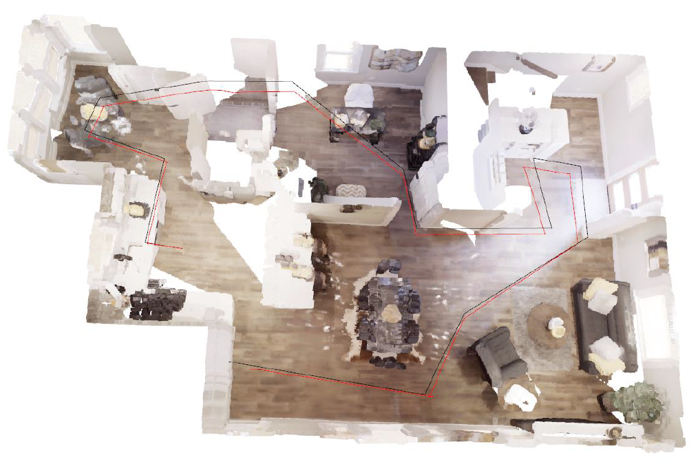

## Description
1. Unproject depth images t_i and t_i+1 to reconstruct two point clouds.
2. Use ICP to obtain the transformation matrix.
3. Align point cloud at t_i+1 to point cloud at t_i.

## Visualization

